<!-- 01 login -->
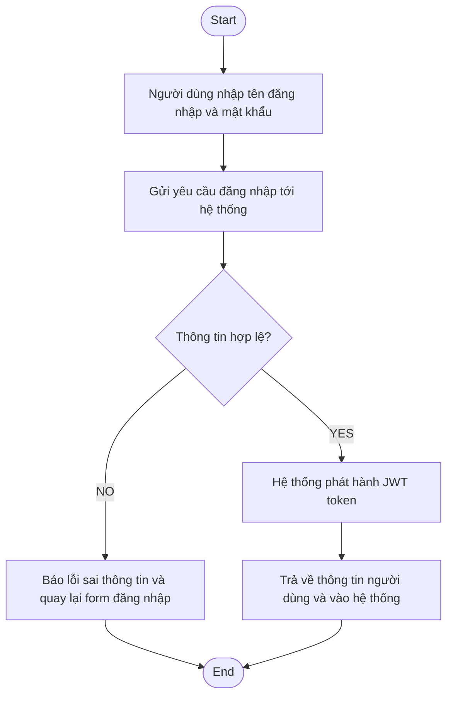

<!-- 02 book-court -->
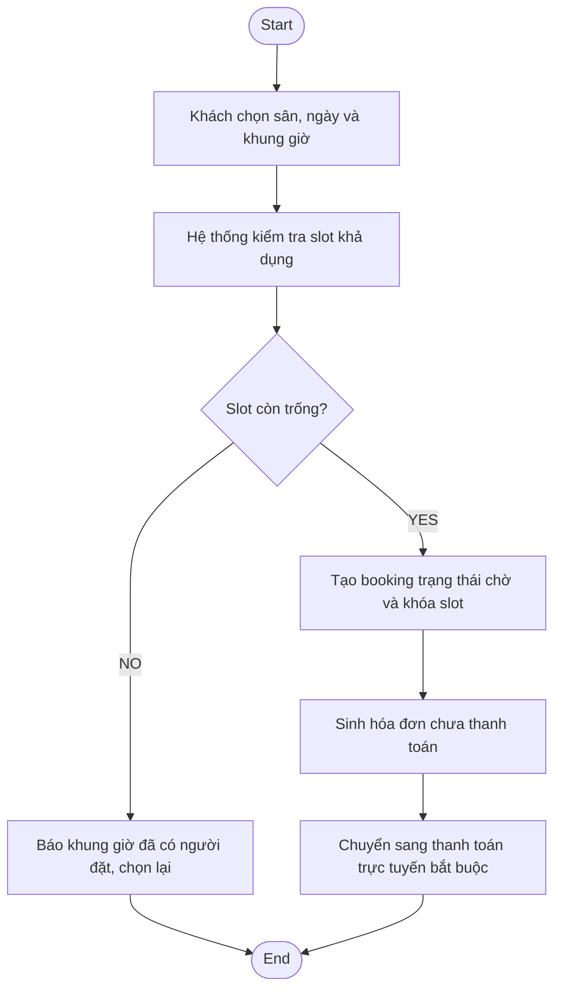

<!-- 03 fixed-schedule -->
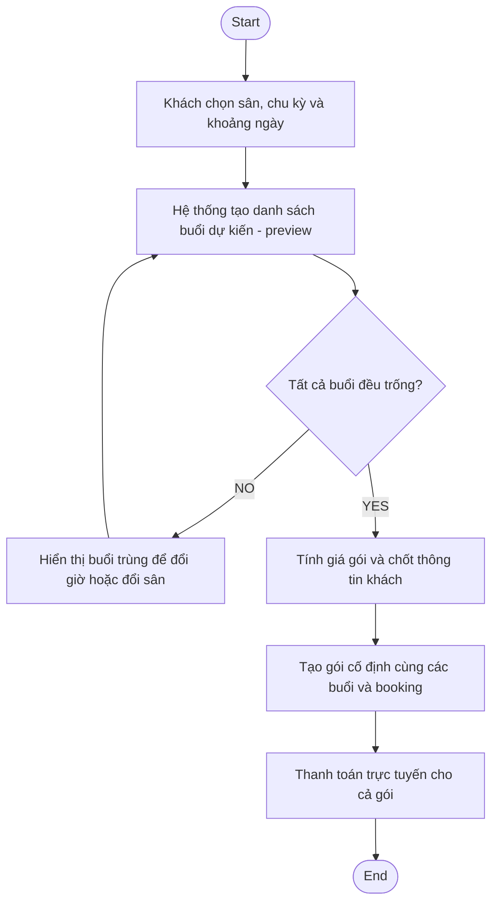

<!-- 04 order -->
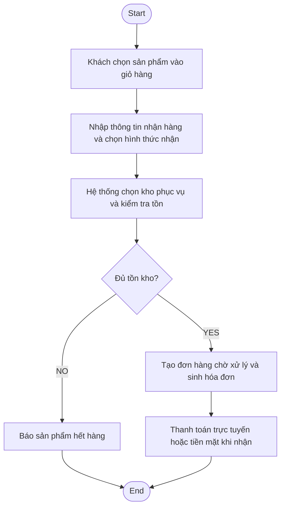

<!-- 05 payment -->
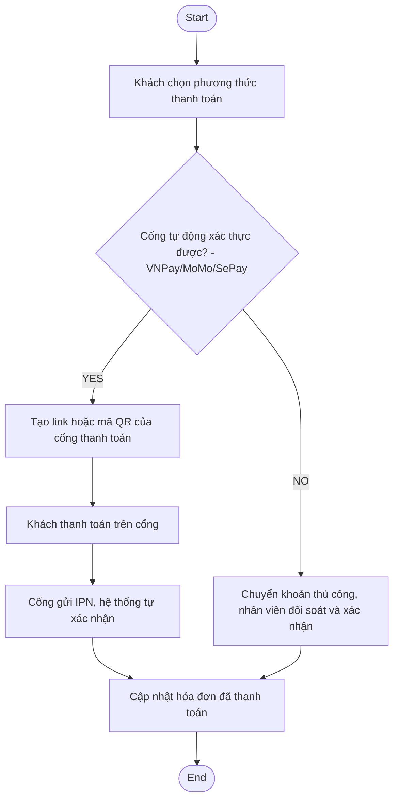

<!-- 06 review -->
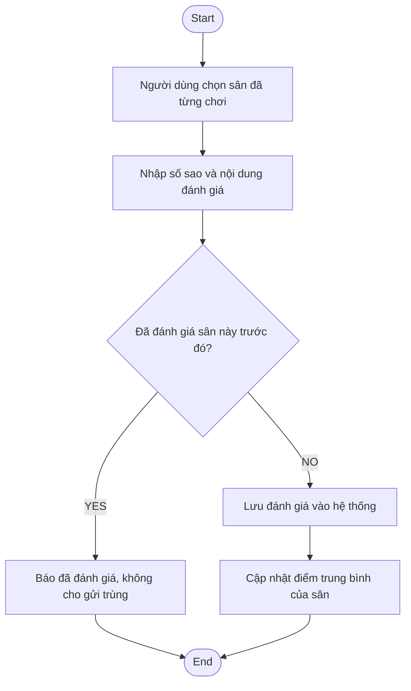

<!-- 07 checkin -->
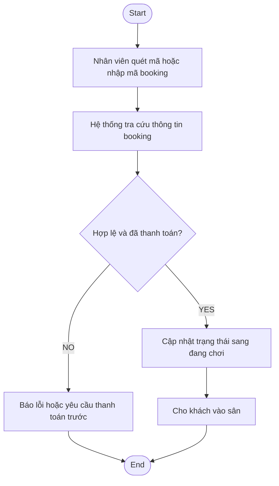

<!-- 08 confirm-payment -->
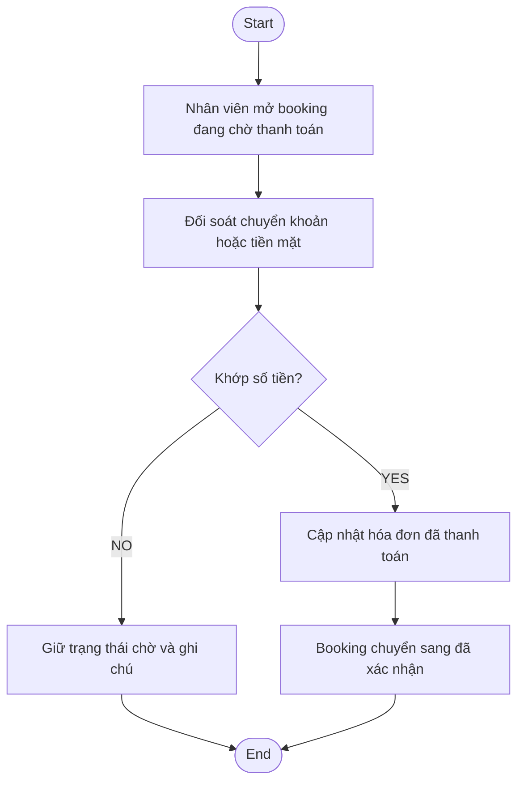

<!-- 09 pos -->
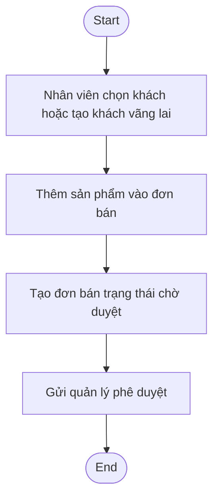

<!-- 10 import-stock -->
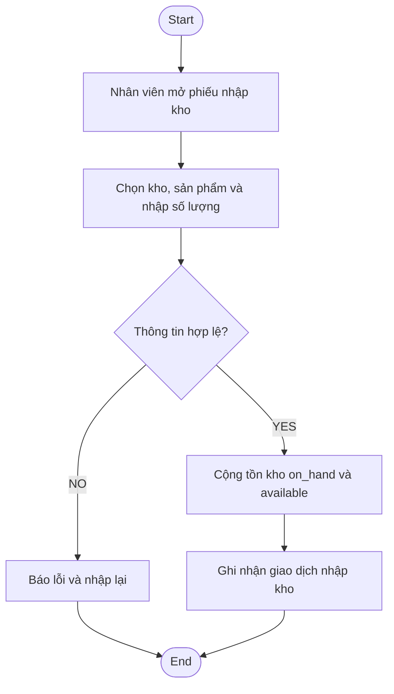

<!-- 11 approve-sales -->
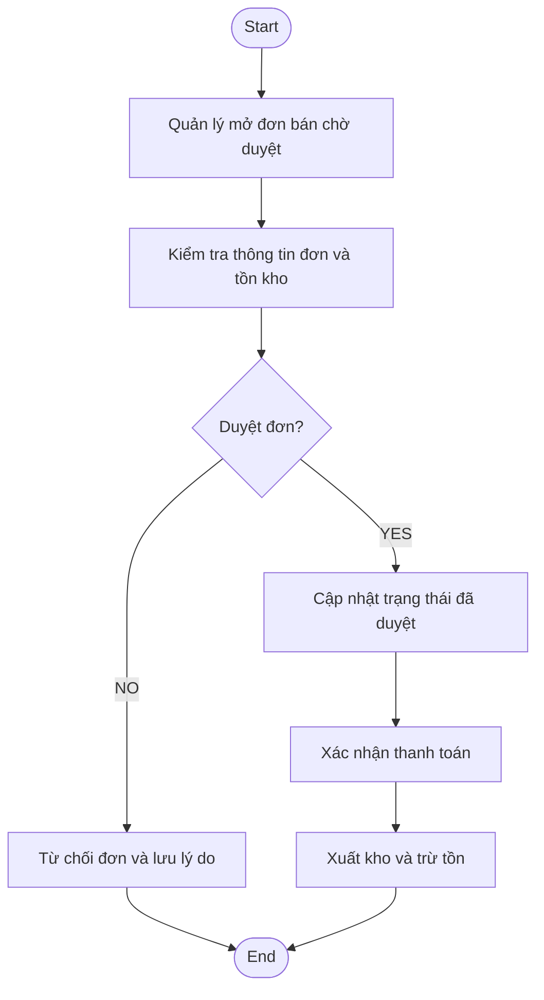

<!-- 12 purchase-order -->
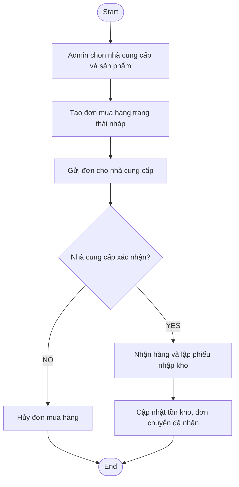

<!-- 13 transfer -->
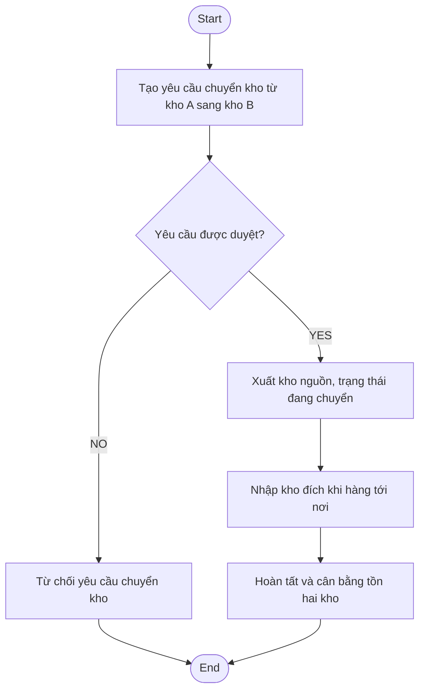

<!-- 14 dashboard -->
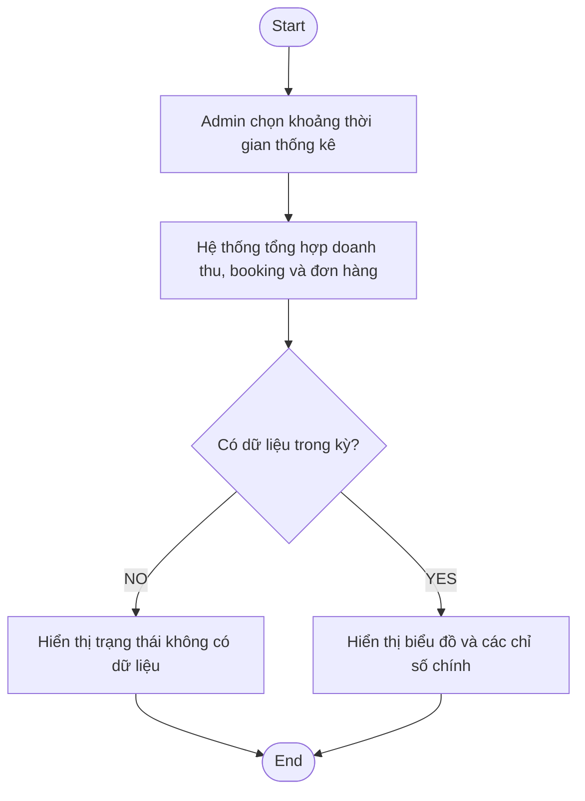
