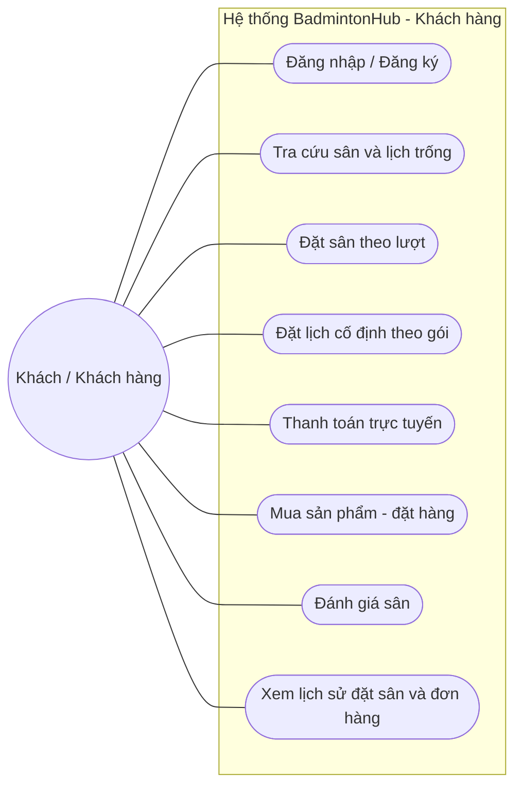
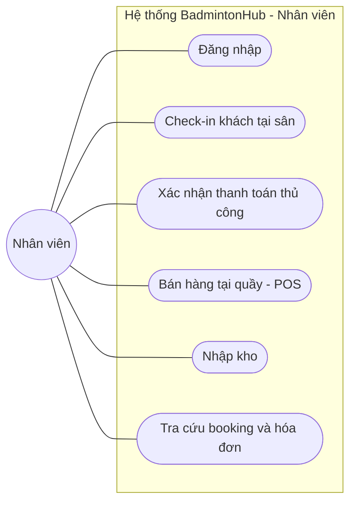
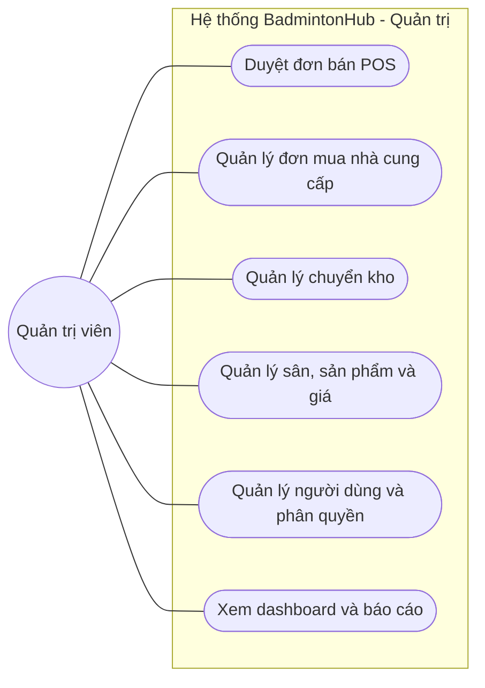

<!-- 01 uc-customer -->

```mermaid
flowchart LR
  KH(("Khách / Khách hàng"))
  subgraph SYS["Hệ thống BadmintonHub - Khách hàng"]
    direction TB
    U1(["Đăng nhập / Đăng ký"])
    U2(["Tra cứu sân và lịch trống"])
    U3(["Đặt sân theo lượt"])
    U4(["Đặt lịch cố định theo gói"])
    U5(["Thanh toán trực tuyến"])
    U6(["Mua sản phẩm - đặt hàng"])
    U7(["Đánh giá sân"])
    U8(["Xem lịch sử đặt sân và đơn hàng"])
  end
  KH --- U1
  KH --- U2
  KH --- U3
  KH --- U4
  KH --- U5
  KH --- U6
  KH --- U7
  KH --- U8
```

<!-- 02 uc-employee -->

```mermaid
flowchart LR
  NV(("Nhân viên"))
  subgraph SYS["Hệ thống BadmintonHub - Nhân viên"]
    direction TB
    E1(["Đăng nhập"])
    E2(["Check-in khách tại sân"])
    E3(["Xác nhận thanh toán thủ công"])
    E4(["Bán hàng tại quầy - POS"])
    E5(["Nhập kho"])
    E6(["Tra cứu booking và hóa đơn"])
  end
  NV --- E1
  NV --- E2
  NV --- E3
  NV --- E4
  NV --- E5
  NV --- E6
```

<!-- 03 uc-admin -->

```mermaid
flowchart LR
  AD(("Quản trị viên"))
  subgraph SYS["Hệ thống BadmintonHub - Quản trị"]
    direction TB
    A1(["Duyệt đơn bán POS"])
    A2(["Quản lý đơn mua nhà cung cấp"])
    A3(["Quản lý chuyển kho"])
    A4(["Quản lý sân, sản phẩm và giá"])
    A5(["Quản lý người dùng và phân quyền"])
    A6(["Xem dashboard và báo cáo"])
  end
  AD --- A1
  AD --- A2
  AD --- A3
  AD --- A4
  AD --- A5
  AD --- A6
```
